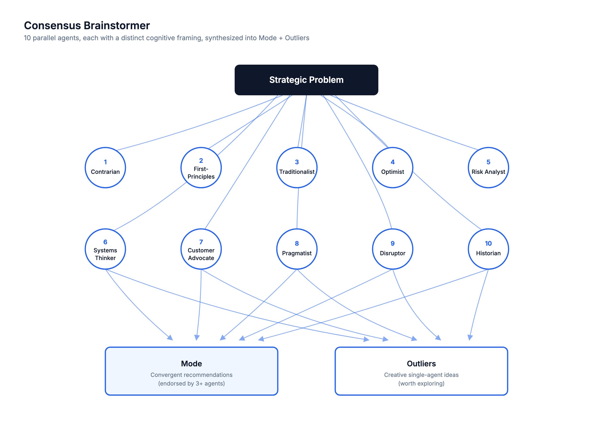

# consensus-brainstormer

> Spawn 10 parallel agents with distinct cognitive framings, then surface the Mode (convergent high-confidence picks) and Outliers (creative single-agent ideas) — for strategic decisions where both safe bets and wild cards matter.



## Use this when...

- You're making an **architecture or product-strategy decision** and a single perspective keeps missing things
- You want **both the safe play and the creative wildcard** in one pass — not averaged into mush
- You suspect **groupthink** is shaping the current proposal and you want adversarial lenses (Contrarian, Risk Analyst, Disruptor) stress-testing it
- You need to **justify a call to stakeholders** and want to show "10 independent perspectives converged on X"
- You're evaluating 3-5 viable options and want to know which one has the **broadest support across reasoning styles**

## What you say to Claude

```
Brainstorm with consensus: should we rewrite the payments service
in Go, or keep patching the existing Node version?
We have a 2-person backend team and 6 weeks.
```

Claude clarifies constraints, then fans out 10 Sonnet agents in parallel — each primed as a different persona (Contrarian, First-Principles, Traditionalist, Optimist, Risk Analyst, Systems Thinker, Customer Advocate, Pragmatist, Disruptor, Historian). Each returns a top-3 recommendation list. Claude then synthesizes the results itself (not a delegated agent) into Mode, Clusters, and Outliers.

For lower-stakes decisions, add _"quick"_ to use 5 agents. For high-stakes, add _"deep"_ to run 3 adversarial follow-ups that try to break the top Mode picks.

## Install

```bash
# From the claude-toolkit repo
./install.sh --skills consensus-brainstormer             # into current project
./install.sh --global --skills consensus-brainstormer    # into ~/.claude (all projects)
```

After install, Claude invokes this skill automatically when you say "brainstorm with consensus", "multi-agent analysis", or "get multiple perspectives on". You can also trigger it explicitly with _"use the consensus-brainstormer skill to..."_.

New to skills? See the [main README](../../README.md#what-is-a-skill) for a one-minute primer.

## What you'll see

- **Mode section** — high-confidence recommendations endorsed by 3+ of 10 agents, ranked by endorsement count, with the framings that agreed
- **Clusters section** — moderate-signal ideas backed by exactly 2 agents (worth considering, need more validation)
- **Outliers section** — creative single-agent ideas with a "potential value if correct" note (preserved explicitly, never averaged away)
- **Tensions & Trade-offs** — places where agents directly contradicted each other, which usually reveal the real decision
- **Recommended Next Steps** — 2-3 concrete actions drawn from the synthesis

## See also

- [`debate-chamber`](../debate-chamber/README.md) — when you've got a Mode from this skill but want to stress-test it through 3 rounds of iterative argument
- [`research-orchestrator`](../research-orchestrator/README.md) — when the problem needs _external information_ first (web research across axes), not just reasoning
