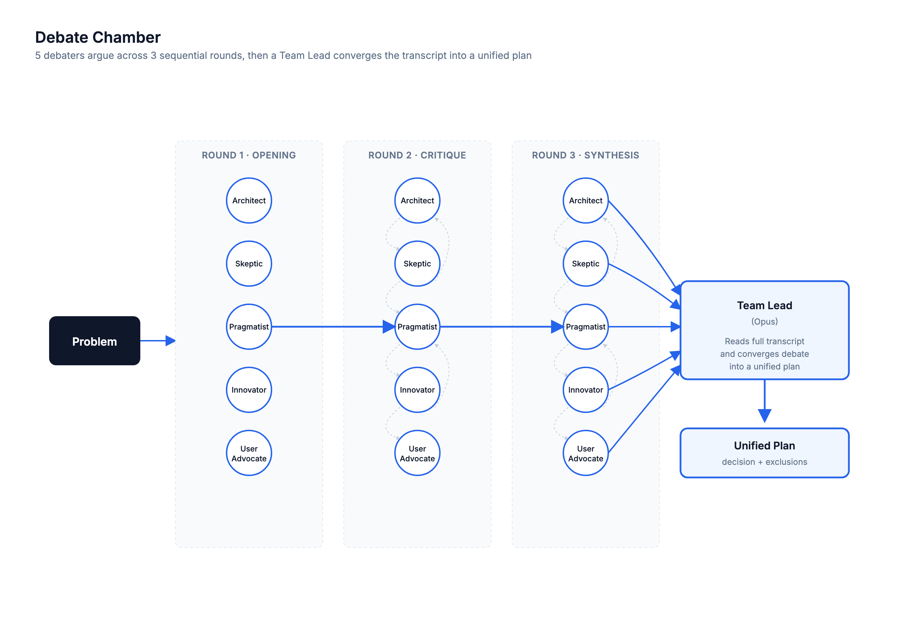

# debate-chamber

> 5 debaters argue across 3 sequential rounds — opening, critique, synthesis — then a Team Lead converges the full transcript into a unified implementation plan. For problems where the first answer is rarely the best answer.



## Use this when...

- You have an **implementation plan** and you want trade-offs argued through, not just listed
- The first proposed design feels right but you **don't trust it yet** — you want it attacked and refined
- You want ideas to **collide and improve** rather than just be collected in parallel
- You've already run a consensus brainstorm and want to **stress-test the Mode** through iterative debate
- The decision has **genuine trade-offs** and the cost of being wrong justifies a slower, deeper process

## What you say to Claude

```
Debate this: we need a rate-limiting strategy for our public API.
Options on the table are token bucket, fixed window, and sliding log.
Argue through it and give me a plan.
```

Claude clarifies constraints, then runs Round 1 (5 debaters post opening positions independently — no cross-talk, prevents herding), Round 2 (each debater sees the full Round 1 transcript and must attack the weakest proposal + steal the best idea from another debater), and Round 3 (synthesis — each debater produces a final refined position). Then a single **Opus Team Lead** reads the complete transcript and produces a decision, a plan, and a "What We're NOT Doing" list.

Add _"quick"_ for 3 debaters × 2 rounds, or _"deep"_ for a 4th adversarial round that tries to break the Team Lead's draft plan.

## Install

```bash
# From the claude-toolkit repo
./install.sh --skills debate-chamber             # into current project
./install.sh --global --skills debate-chamber    # into ~/.claude (all projects)
```

After install, Claude invokes this skill when you say "debate this", "argue through", or "adversarial debate". You can also trigger it explicitly with _"use the debate-chamber skill to..."_.

New to skills? See the [main README](../../README.md#what-is-a-skill) for a one-minute primer.

## What you'll see

- **Decision Summary** — 2-3 sentences stating what was chosen and why (a decision, not a hedge)
- **The Plan** — numbered actionable steps, each tagged with which debater argued for it and the key risk identified during debate
- **What We're NOT Doing (and Why)** — ideas that were proposed and explicitly rejected, with revisit conditions
- **Open Questions** — genuine uncertainties the debate surfaced but couldn't resolve
- **Debate Scorecard** — each debater's best contribution and biggest blind spot

## Consensus vs Debate — which one?

| Dimension         | consensus-brainstormer              | debate-chamber                          |
| ----------------- | ----------------------------------- | --------------------------------------- |
| Agent interaction | Independent, no cross-talk          | Iterative, agents respond to each other |
| Rounds            | 1 (parallel)                        | 3 sequential + convergence              |
| Strength          | Breadth of ideas, outlier discovery | Depth of analysis, idea refinement      |
| Speed             | Faster (1 parallel dispatch)        | Slower (3 sequential rounds)            |
| Best for          | "What are our options?"             | "Which option is best and why?"         |

## See also

- [`consensus-brainstormer`](../consensus-brainstormer/README.md) — when you need breadth and outliers first, before picking something to debate
- [`research-orchestrator`](../research-orchestrator/README.md) — when the debate needs _external data_ to be productive (pull findings first, then argue)
