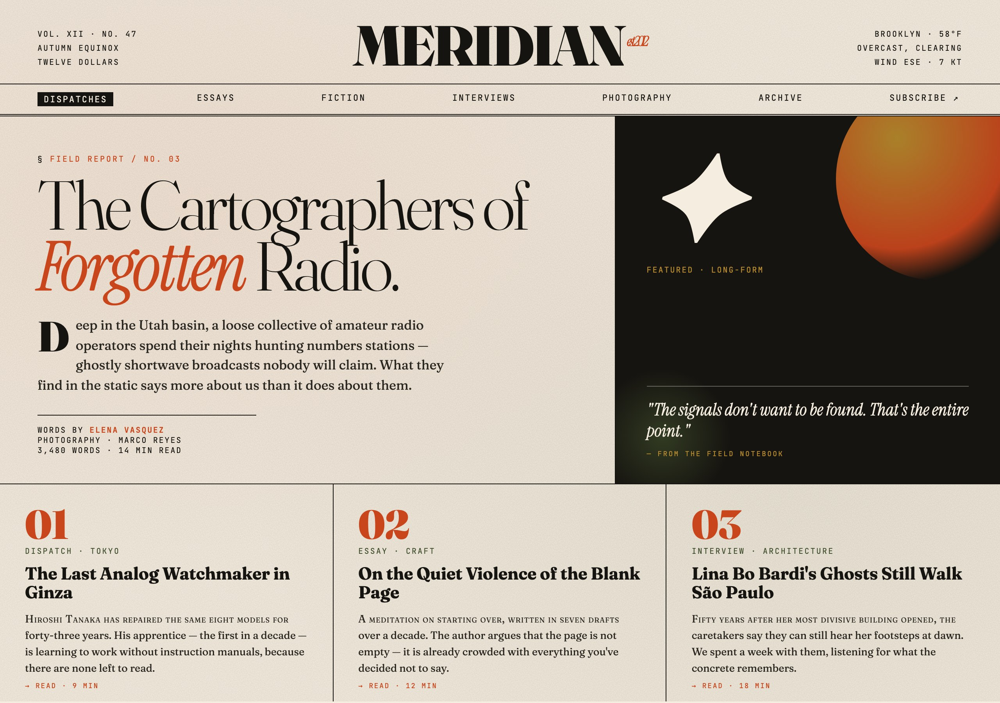

# frontend-design

> Build distinctive, production-grade web interfaces with a strong aesthetic point-of-view — not generic AI slop.



## Use this when...

- You're building a landing page, marketing site, or hero section and **the default "Inter on white with purple gradients" aesthetic is unacceptable**
- You need a component, dashboard, or admin panel that **actually commits to a visual identity** (editorial, brutalist, retro-futuristic, etc.)
- You're tired of AI-generated UI that all looks the same and want Claude to **pick a bold direction and execute it with precision**
- You have a vague vibe in mind ("something that feels like a print magazine" / "cyberpunk terminal" / "soft pastel wellness app") and want it turned into working code
- You're implementing an approved mockup and want the final code to **keep the distinctiveness** instead of sanding it down to defaults

## What you say to Claude

```
Build a landing page for a small-batch coffee roaster.
I want an editorial magazine feel — not another minimal SaaS site.
Distinctive display font, warm paper background, commit to it.
```

Claude picks a conceptual direction (tone, typography, palette, layout), loads distinctive Google Fonts, and writes real HTML/CSS/JS (or React/Vue) with thoughtful spacing, animation, and typographic detail — no Inter, no purple gradients, no cookie-cutter hero sections.

## Install

```bash
# From the claude-toolkit repo
./install.sh --skills frontend-design             # into current project
./install.sh --global --skills frontend-design    # into ~/.claude (all projects)
```

After install, Claude invokes this skill automatically when you ask for frontend work — landing pages, components, dashboards, marketing sites. You can also trigger it explicitly with _"use the frontend-design skill to..."_.

New to skills? See the [main README](../../README.md#what-is-a-skill) for a one-minute primer.

## What you'll see

- **A committed aesthetic direction** — brutalist, editorial, retro-futuristic, soft organic, industrial — not a blend of all of them
- **Distinctive typography** — a display font paired with a refined body font, usually from Google Fonts, never Inter or Arial
- **Intentional color** — dominant tones with sharp accents instead of timid, evenly-distributed palettes
- **Spatial composition with character** — asymmetry, overlap, grid-breaking, generous negative space or controlled density
- **Production-grade code** — real working HTML/CSS/JS that you can ship, not screenshot-only mockups

The hero above is an example the skill produced for a fictional magazine called _Meridian_ — Fraunces display type, cream paper background, rust-and-moss palette, sun/moon abstract, three-column bottom row. That's the quality bar.

## See also

- [`ux-mockup`](../ux-mockup/README.md) — for iterating on design with stakeholder feedback _before_ you commit to implementation
- [`testing-webapps`](../testing-webapps/README.md) — for visually verifying the built result matches the design intent
