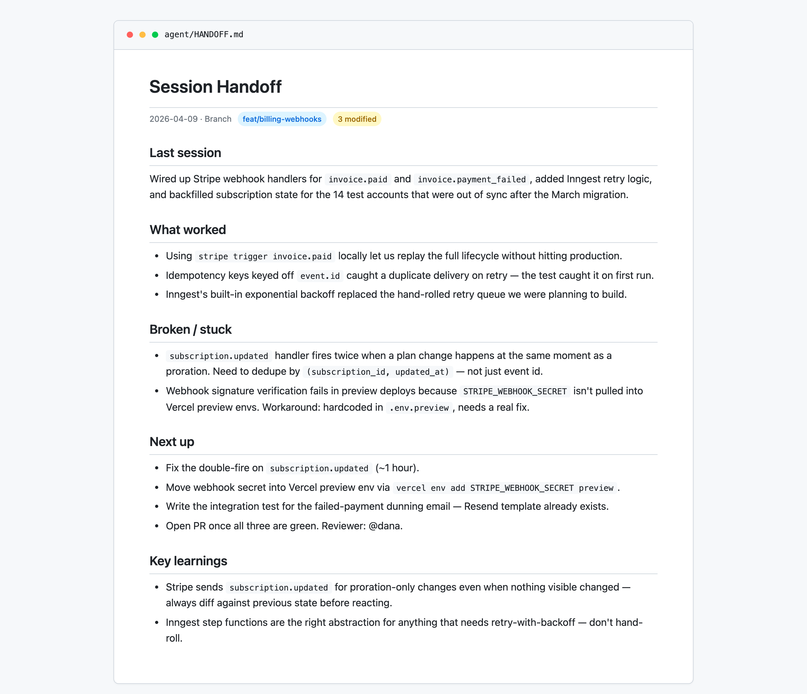

# handoff

> End-of-session skill that writes a `HANDOFF.md` snapshot and appends learnings to `MEMORY.md` — always in a background sub-agent, so it never blocks you wrapping up.



## Use this when...

- You're **wrapping up a session** and want the next one (maybe tomorrow, maybe a fresh Claude instance) to pick up without asking "what were we doing?"
- You're **switching projects** mid-day and need to stash state before context-switching
- You just **figured something out the hard way** and want the learning to persist across sessions, not die in a closed window
- You want handoff writing to **happen in the background** while you respond to Slack, not block your terminal
- You follow the **"read HANDOFF.md on session start"** pattern and need something writing to it consistently

## What you say to Claude

```
/handoff
```

Or, if you want to explicitly capture a specific learning:

```
/handoff "Stripe subscription.updated fires twice on prorated plan changes
— always dedupe by (subscription_id, updated_at)"
```

Claude launches a background sub-agent, immediately confirms with _"Handoff agent launched in background"_, and you can keep working or end the session. The agent runs `git log`, `git status`, `git diff --stat`, synthesizes what happened, and writes both files silently.

## Install

```bash
# From the claude-toolkit repo
./install.sh --skills handoff             # into current project
./install.sh --global --skills handoff    # into ~/.claude (all projects)
```

After install, `/handoff` is available as a slash command. Claude also auto-invokes it when you say _"wrap up"_, _"end session"_, or _"stash this for later"_.

New to skills? See the [main README](../../README.md#what-is-a-skill) for a one-minute primer.

## What you'll see

Two files in `/agent/`:

- **`HANDOFF.md`** — point-in-time snapshot, **overwritten each run**. Branch, git status, summary, what was done, what remains, known issues, key decisions, relevant files, free-form context for the next session.
- **`MEMORY.md`** — **append-only** log of durable learnings, grouped by date. Never rewrites past entries; only appends under today's header if something non-obvious was learned.
- **Background execution** — main chat never blocks. You get an immediate confirmation and a quiet completion message when the sub-agent finishes.
- **Works outside git repos** — skips git commands gracefully and writes what it can.

## Why background

Session-end should be fast. Running the full handoff — reading git state, scanning recent commits, synthesizing a summary — inline would force you to wait 10-30 seconds before you could type "bye" and close the tab. A single background sub-agent does both the note and the snapshot sequentially (one agent, not two, to avoid race conditions on `MEMORY.md`) while you're free to do anything else.

## See also

- [`prd`](../prd/README.md) — write the PRD at the start of the feature, write the handoff at the end of the session that implements it
- [`init`](../init/README.md) — bootstraps `/agent/` and the HANDOFF-on-session-start pattern in a new project
