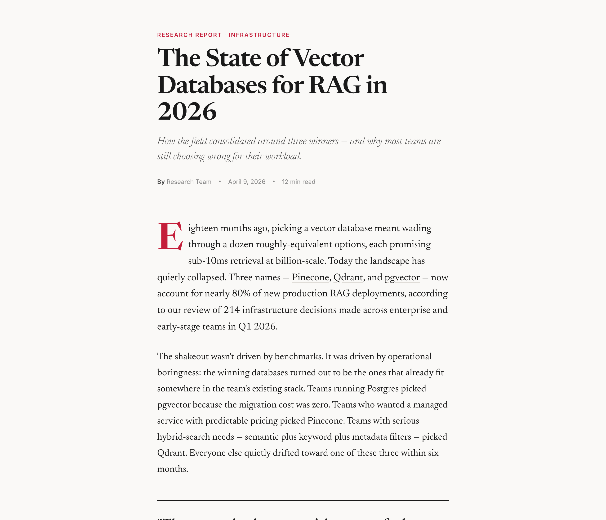

# html-report

> Turn research, analysis, or session findings into a polished editorial-style HTML report — Newsreader serif, inline links, dropcap lead, pull quotes — saved to `~/Documents/Claude Reports/`.



## Use this when...

- You just finished a **research run, competitive analysis, or architecture review** and want it to read like a real article, not a markdown dump
- You need to **share findings with a non-technical stakeholder** who won't open a `.md` file
- You want a report that lives **outside any git repo** — discoverable in Finder, indexed by Spotlight, never accidentally committed
- You want **every tool, product, and video mentioned to be a clickable link**, not a bare footnote at the bottom
- You want the option to **reroll the visual theme** (`--fresh`) so every report doesn't look identical

## What you say to Claude

```
Write this up as an html report — "The State of Vector Databases for RAG in 2026"
```

Claude parses the research already in the session (or reads a markdown file you pass in), extracts the structure — executive summary, findings, recommendations, sources — and writes a self-contained HTML file to `~/Documents/Claude Reports/vector-databases-rag-2026-04-09.html`, then opens it in your browser. Pass `--fresh` to randomize the typography, color palette, and layout.

## Install

```bash
# From the claude-toolkit repo
./install.sh --skills html-report             # into current project
./install.sh --global --skills html-report    # into ~/.claude (all projects)
```

After install, Claude invokes this skill automatically when you ask for a "report", "write-up", or "summary page" — and it chains naturally after `/research-orchestrator` or `/last30days`. You can also trigger it explicitly with `/html-report`.

New to skills? See the [main README](../../README.md#what-is-a-skill) for a one-minute primer.

## What you'll see

The generated HTML file is fully self-contained (Google Fonts only, no JS dependencies) and includes:

- **Editorial masthead** with kicker, headline, italic subtitle, byline, and date
- **Dropcap lead paragraph** followed by prose in 20px Newsreader serif at a 680px column
- **Numbered findings** with HIGH / MEDIUM confidence tags and a pull quote for the strongest insight
- **Inline links on every tool, product, and video** — no "Sources" section at the bottom, every reference is contextual
- **Components that appear only if the content needs them** — decision matrices, cost cards, roadmap timelines, recommendation grids

## The two modes

**Default editorial** — warm off-white background, deep red accent, Newsreader serif headlines, Inter for labels. Every report looks like it came out of the same publication.

**`--fresh` theme system** — on every invocation, Claude picks one option from each of five pools (font pairing, color palette, layout mode, background treatment, component styling) seeded by the date and title. The content structure stays identical; the "outfit" changes. Useful when you're generating several reports and want them to feel distinct at a glance.

## See also

- [`research-orchestrator`](../research-orchestrator/README.md) — the upstream skill that produces the structured findings this report renders
- [`last30days`](../last30days/README.md) — another upstream skill; its multi-source synthesis output pipes directly into `/html-report`
