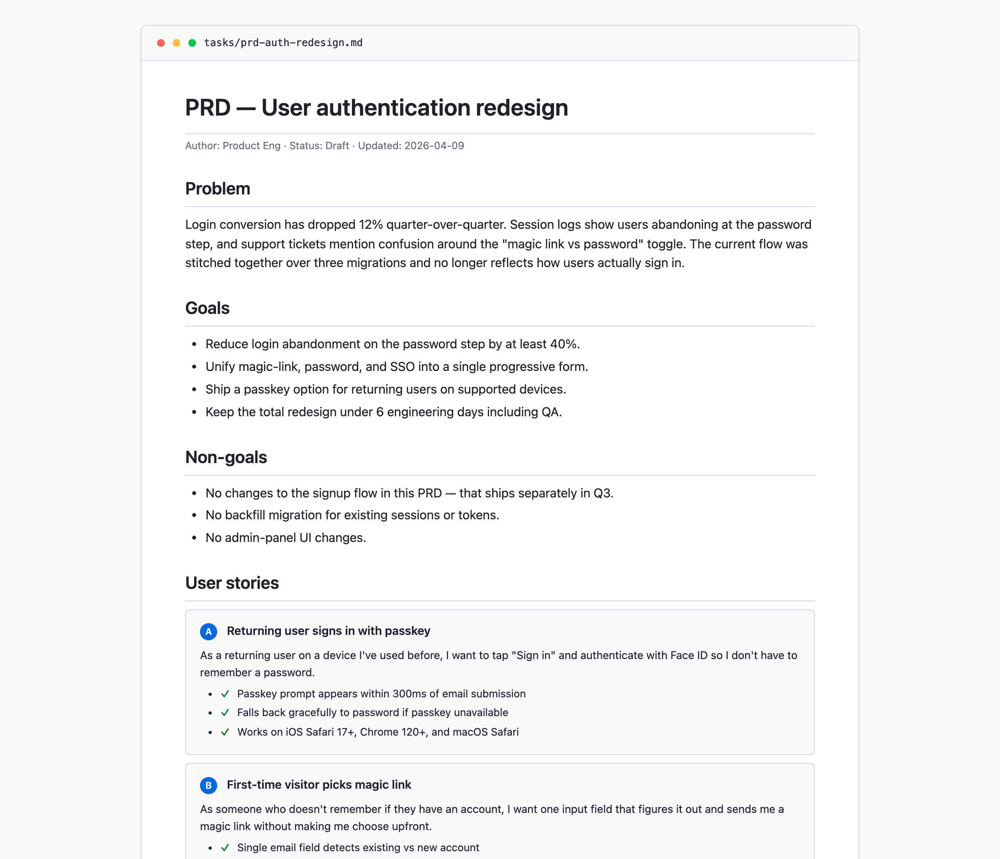

# prd

> Turn a rough feature idea into a structured Product Requirements Document with lettered clarifying questions, numbered requirements, and verifiable acceptance criteria — saved as markdown, ready to hand to a junior dev or an autonomous agent.



## Use this when...

- You're **starting a new feature** and want to pressure-test the idea before anyone writes code
- You need a doc that's **specific enough for a junior dev or an LLM to implement without guessing**
- You want **acceptance criteria that are actually verifiable**, not "works correctly" hand-waving
- You're about to kick off an autonomous coding loop (Ralph, Aider, Devin) and need a PRD **the agent can turn into tasks**
- You want to **force the scope conversation upfront** — what's in, what's out, what the success metric is

## What you say to Claude

```
Write a PRD for a notifications bell — users should see unread
counts, click to open a dropdown of recent items, and mark them
as read. Ship it to the toolkit dashboard.
```

Claude asks 3-5 clarifying questions with lettered options (e.g., _"1. Target user? A. All users B. Admins only C. ..."_), you reply with "1A, 2C, 3B", and the PRD is saved to `tasks/prd-notifications-bell.md` with user stories small enough to each fit in a single focused session.

## Install

```bash
# From the claude-toolkit repo
./install.sh --skills prd             # into current project
./install.sh --global --skills prd    # into ~/.claude (all projects)
```

After install, Claude auto-invokes this skill on phrases like _"create a PRD"_, _"spec out this feature"_, or _"write requirements for..."_. You can also trigger it explicitly.

New to skills? See the [main README](../../README.md#what-is-a-skill) for a one-minute primer.

## What you'll see

The generated markdown file follows a strict structure designed for implementation, not for stakeholders:

- **Clarifying questions first** — lettered multiple-choice so you reply with "1A, 2C, 3B" instead of paragraphs
- **Numbered functional requirements** (`FR-1`, `FR-2`, ...) you can reference from code comments and PRs
- **User stories with verifiable acceptance criteria** — each story small enough for one focused session
- **Explicit non-goals section** — scope boundaries called out, not left ambiguous
- **Success metrics** that are measurable, not vibes ("login completion > 88%")

Every UI story automatically gets `Verify in browser using dev-browser skill` as an acceptance criterion, so frontend work isn't marked done until it's visually confirmed.

## Why "lettered options"

Clarifying questions in free-form prose turn into a slow back-and-forth. Lettered options compress the round trip — Claude asks five questions at once, you answer with a 10-character reply, and the PRD generates immediately. If none of the options fit, the last choice is always _"Other: [please specify]"_.

## See also

- [`ralph`](../ralph/README.md) — converts the PRD this skill produces into `prd.json` for the Ralph autonomous agent loop
- [`handoff`](../handoff/README.md) — write an end-of-session snapshot referencing which stories from the PRD are done
