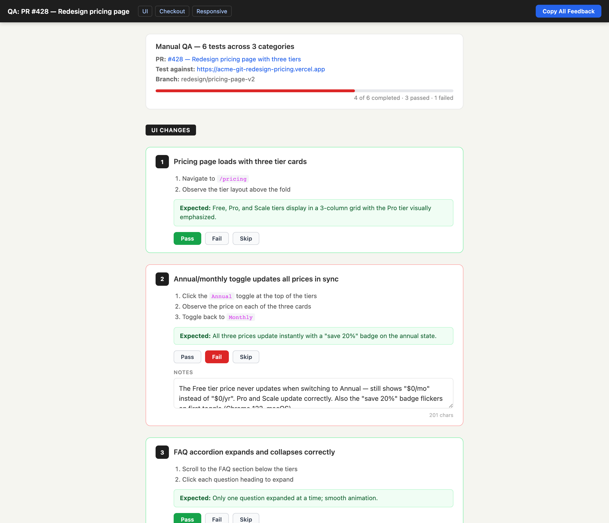

# qa-checklist

> Generate an interactive manual-QA checklist as a self-contained HTML page after a PR lands — with pass/fail/skip buttons, per-test notes, and clipboard export back into chat.



## Use this when...

- You just opened a PR and need to **manually verify the parts your automated tests can't cover** (visual, responsive, flows, real API behavior)
- You want a **single HTML file per PR** you can open in a browser, click through, and attach to the PR description when you're done
- You need a **non-developer teammate** to test a preview deployment without teaching them your test framework
- You want QA results to come back as **structured JSON you paste into chat**, not a wall of Slack messages
- You want Claude to read the PR diff and **tell you what to test** instead of writing the checklist yourself

## What you say to Claude

```
I just opened PR #428 for the pricing page redesign.
Generate a QA checklist for the manual stuff the e2e tests won't catch.
```

Claude runs `gh pr view`, reads the diff and existing tests, finds the Vercel preview URL, and writes a self-contained HTML file to `docs/qa/428-pricing-redesign.html`. It opens in your browser automatically. You click through, mark each test pass/fail/skip, add notes, and hit **Copy All Feedback** to paste the results back into the conversation.

## Install

```bash
# From the claude-toolkit repo
./install.sh --skills qa-checklist             # into current project
./install.sh --global --skills qa-checklist    # into ~/.claude (all projects)
```

After install, Claude invokes this skill automatically when you mention "qa checklist", "manual testing", "what should I test", or right after a PR is created. You can also trigger it explicitly with _"use the qa-checklist skill to..."_.

New to skills? See the [main README](../../README.md#what-is-a-skill) for a one-minute primer.

## What you'll see

The generated HTML file is fully self-contained (no CDN, no build step) and includes:

- **Sticky nav** with category anchor links and a **Copy All Feedback** button
- **Summary banner** showing PR title, preview URL, branch, and a live progress bar
- **Numbered test cards** grouped by category (UI, API, responsive, etc.) with concrete steps and expected results
- **Pass / Fail / Skip buttons** per test that color the card border and update progress
- **Per-test notes textareas** for describing what you actually observed
- **JSON export** via clipboard — a structured summary of passed/failed/skipped tests plus notes, ready to paste back to Claude

## See also

- [`ux-mockup`](../ux-mockup/README.md) — same feedback-collection pattern, but for design review before a PR is even written
- [`manual-qa-collab`](../manual-qa-collab/README.md) — for driving the browser yourself with Playwright instead of handing the checklist to a human
