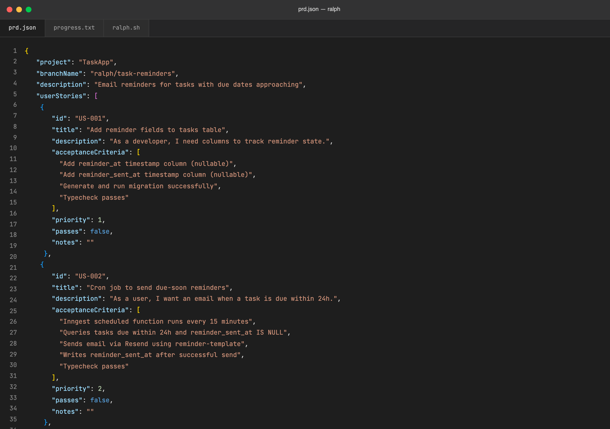

# ralph

> Convert an existing PRD into the `prd.json` format the Ralph autonomous agent loop runs on — with dependency-ordered stories small enough to each fit in one Amp context window.



## Use this when...

- You have a PRD **already written** (from the `prd` skill or anywhere else) and need it in Ralph's JSON schema before kicking off a run
- You want to **split a big feature** into iterations that each fit in a single context window, instead of watching Ralph run out of tokens mid-story
- You need to **enforce dependency ordering** — schema before backend, backend before UI, dashboards last
- You want every story to automatically carry **"Typecheck passes"** and (for UI work) **"Verify in browser using dev-browser skill"** as final acceptance criteria
- You're **re-running Ralph** on a different feature and need the previous run archived before overwriting `prd.json`

## What you say to Claude

```
Convert tasks/prd-task-reminders.md into prd.json for ralph.
```

Or paste PRD text directly:

```
Turn this into ralph format: [paste PRD]
```

Claude reads the PRD, splits anything too big into per-iteration stories, orders them by dependency, adds the required final criteria, and writes `prd.json` to your ralph directory. If a previous run exists under a different `branchName`, it archives it to `archive/YYYY-MM-DD-feature-name/` first.

## Install

```bash
# From the claude-toolkit repo
./install.sh --skills ralph             # into current project
./install.sh --global --skills ralph    # into ~/.claude (all projects)
```

After install, Claude auto-invokes on phrases like _"convert this PRD"_, _"turn this into ralph format"_, or _"create prd.json from this"_.

New to skills? See the [main README](../../README.md#what-is-a-skill) for a one-minute primer.

## What you'll see

A valid `prd.json` that drops straight into your Ralph workflow:

- **Sequential story IDs** (`US-001`, `US-002`, ...) with `priority` matching dependency order
- **Stories small enough for one iteration** — rule of thumb: if it can't be described in 2-3 sentences, it's too big and gets split
- **Verifiable acceptance criteria** — no "works correctly", only things Ralph can actually check
- **Auto-appended final criteria** — `"Typecheck passes"` on every story, `"Verify in browser using dev-browser skill"` on UI stories
- **`passes: false` and empty `notes`** on every story so Ralph starts fresh

## The number one rule

**Each story must be completable in one Ralph iteration.** Ralph spawns a fresh Amp instance per iteration with no memory of previous work — if a story is too big, the LLM runs out of context mid-implementation and produces broken code. The skill errs aggressively on the side of splitting: "Add authentication" becomes six stories (schema, middleware, login UI, session, logout, password reset), not one.

## See also

- [`prd`](../prd/README.md) — writes the upstream PRD this skill consumes, with user stories already in the right shape
- [`handoff`](../handoff/README.md) — capture learnings between Ralph runs so the next iteration doesn't repeat the same mistakes
