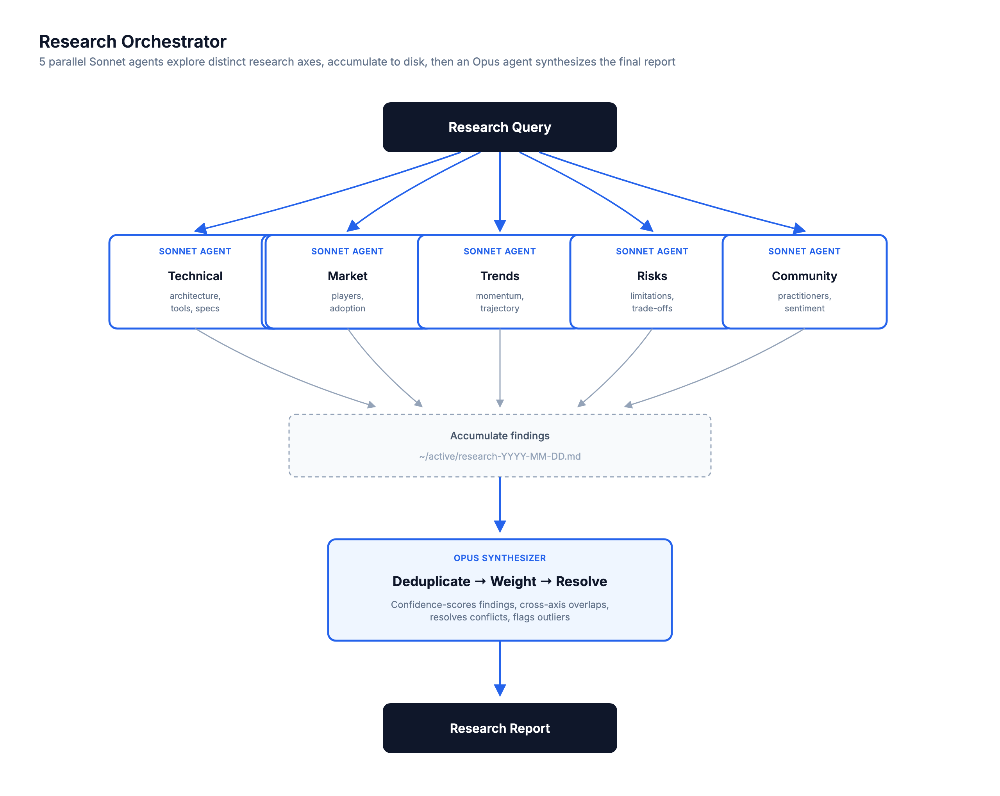

# research-orchestrator

> Fan out 5 parallel Sonnet research agents across distinct axes, accumulate their findings to a file, then fan in with a single Opus synthesizer that deduplicates, confidence-weights, resolves conflicts, and writes the final report.



## Use this when...

- You need **multi-perspective research** on a topic and a single web search won't cut it — you want Technical, Market, Trends, Risks, and Community angles simultaneously
- You're doing a **competitive analysis** or **technology evaluation** and need a report you can paste into a doc, not a chat-thread of findings
- You want **source-cited findings with confidence scores** — not a vibes-based summary
- You want parallel agents to run **in the background** while you keep working, getting notified as each completes
- You care about **cross-axis corroboration** — findings that showed up independently in 2+ axes are the ones you can actually trust

## What you say to Claude

```
Research this: what are the best approaches to building AI agents
in 2026? I want to know the frameworks people are actually shipping,
the common failure modes, and where the field is heading.
```

Claude decomposes the query into 5 research axes (e.g. Technical, Market, Practitioner Experience, Cost, Trends), shows them to you for confirmation, then spawns 5 Sonnet agents in parallel — each using WebSearch and WebFetch to investigate its axis. All findings accumulate into `~/active/research-YYYY-MM-DD.md` with finding IDs. Once all 5 complete, a single **Opus synthesizer** reads the full file and produces the final report.

Add _`--quick`_ to return results as soon as 3 of 5 agents finish (faster, coverage gaps flagged in the report).

## Install

```bash
# From the claude-toolkit repo
./install.sh --skills research-orchestrator             # into current project
./install.sh --global --skills research-orchestrator    # into ~/.claude (all projects)
```

After install, Claude invokes this skill automatically when you ask for research, competitive analysis, or technology evaluation. You can also trigger it explicitly with _"use the research-orchestrator skill to..."_.

New to skills? See the [main README](../../README.md#what-is-a-skill) for a one-minute primer.

## What you'll see

- **Executive Summary** — 3-5 sentence answer to the original query
- **Key Findings** ranked by confidence score (High/Medium/Low), each tagged with which axes corroborated it and a source URL
- **Cross-Axis Overlaps** — findings that appeared in 2+ axes independently (highest confidence, the strongest signal)
- **Unique Outliers** — surprising single-axis findings that warrant attention despite only appearing once
- **Conflicts & Uncertainties** — places where sources disagreed, the resolution protocol applied, and the final call
- **Consolidated Sources** — deduplicated URL list grouped by axis, and a full transcript saved to `~/active/research-YYYY-MM-DD.md`

## See also

- [`consensus-brainstormer`](../consensus-brainstormer/README.md) — when the problem is reasoning through options you already know about, not pulling in new external information
- [`debate-chamber`](../debate-chamber/README.md) — when you've got the research and now need to argue through what to actually do with it
