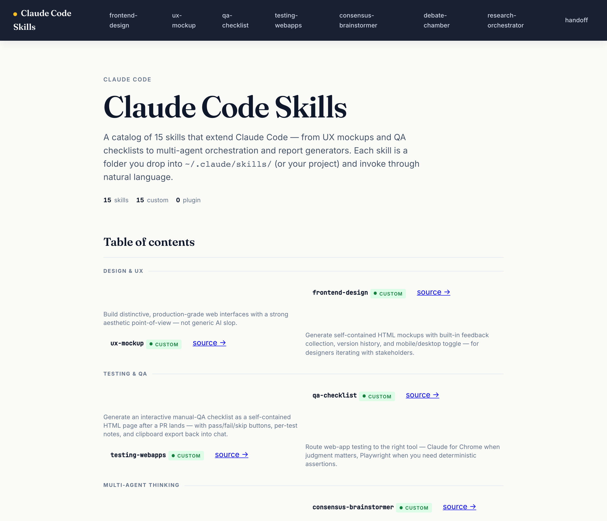

# skill-showcase

> Build a single-file public HTML showcase of a collection of Claude Code skills — table of contents, category grouping, custom-vs-plugin badges, PII scrubbing.



## Use this when...

- You want to **publish a portfolio** of the skills you've built so other people can see what's possible with Claude Code
- You want a **single HTML page you can host anywhere** (GitHub Pages, S3, Vercel, a static file share) without a build step or dependencies
- You need to **share your skills externally without leaking personal info** — repo paths, GitHub username, real name, project names, etc.
- You want a **visual inventory** of what's installed in `~/.claude/skills/`, clearly separated into skills you authored vs skills pulled from plugins
- You have a repo full of skill folders and want an **index page with screenshots**, not just a plain README list

## What you say to Claude

```
Use skill-showcase to build a public page for all the custom
skills in this repo. Exclude the half-finished ones.
```

Claude scans the skills directory, groups skills by category, renders each README with its hero image inline, scrubs your name and GitHub username, and writes a single HTML file at `docs/showcase/skills.html`. Then it opens the file in your browser.

To point it at a different location:

```
Build a skill showcase from ~/.claude/skills/ and write it
to ~/Sites/skills.html.
```

## Install

```bash
# From the claude-toolkit repo
./install.sh --skills skill-showcase             # into current project
./install.sh --global --skills skill-showcase    # into ~/.claude (all projects)
```

After install, Claude will invoke this skill when you ask to "showcase my skills", "build a skill gallery", "make a public page for these skills", or similar phrasing. The reference build script lives at `scripts/build-showcase.js` and can also be run directly with `node`.

New to skills? See the [main README](../../README.md#what-is-a-skill) for a one-minute primer.

## What you'll see

- **A single self-contained HTML file** — all CSS and JS inline, works offline, hosts anywhere
- **Hero section** with title, short description, and a count of total / custom / plugin skills
- **Table of contents** grouped by category, with a one-line tagline and a badge under every skill
- **Full skill sections** below, each with its hero image and the complete README rendered inline
- **Custom vs Plugin badges** — green `● Custom` for skills you authored, blue `◆ Plugin` for skills pulled from a plugin cache, with the plugin name if it can be determined
- **Optional `source →` links** to the public GitHub source of each skill — opt-in, only rendered when you pass `--base-repo` or set `repo:` in a skill's frontmatter (see below)
- **PII scrubbed** — your real name, GitHub username, and personal file paths are replaced with placeholders before the page is written, and a final grep verifies nothing slipped through

## How PII scrubbing works

Before rendering each README, the skill pulls identifiers from your environment and replaces them in memory (the original files are never modified):

- **Your git name** (from `git config user.name`) — removed, with possessive forms replaced by _"Your"_
- **Your git email** → `<your-email>`
- **Home directory paths** like `/Users/you/` or `/home/you/` → `~/`
- **GitHub usernames** in URLs — the skill detects owners from `github.com/<owner>/` patterns in the combined content and replaces them with `<your-username>`

After writing the output, the skill greps the final HTML for all detected identifiers and fails loudly if anything leaked. **Hero images are not scrubbed** — the skill cannot edit rasterized pixels. If a hero contains PII in its rendered text (e.g. a dashboard with your name in the title), regenerate that hero before running the showcase.

## Linking to public source (opt-in)

If you want the showcase to link to your actual public repo — because you're sharing it and want viewers to be able to fork the code — pass `--base-repo`:

```bash
node skills/skill-showcase/scripts/build-showcase.js \
  --skills-dir ./skills \
  --output ./docs/showcase/skills.html \
  --base-repo https://github.com/yourname/claude-toolkit/tree/main/skills
```

Every skill in the output gets a small `source →` link next to its badge, pointing to `github.com/yourname/claude-toolkit/tree/main/skills/<skill-id>`. Without `--base-repo`, no source links are rendered at all.

**Per-skill overrides** — in a skill's `SKILL.md` frontmatter:

- `repo: none` or `repo: private` — suppresses the source link for that specific skill (use this for skills you authored but don't want to share)
- `repo: https://github.com/other/other-repo/tree/main/skills/that-skill` — uses that URL instead of the `--base-repo` default (use this for skills that live in a different repo)

Skills with no frontmatter `repo:` field use `--base-repo` if provided, otherwise no link.

**The `--base-repo` URL is not scrubbed.** The sanitizer protects against accidental leaks in README content, but passing `--base-repo` is an intentional opt-in — if you include your GitHub username in the URL, it will appear in the output.

## Self-test

The script ships with a `--self-test` flag that runs fixtures through the full pipeline and verifies the invariants that protect the sanitize step:

```bash
node skills/skill-showcase/scripts/build-showcase.js --self-test
```

The self-test runs 3 fixtures (`fence-preservation`, `pii-scrubbing`, `edge-cases`) and asserts:

1. The sanitize pass preserves newlines exactly (never collapses them — this was a real v0 bug)
2. The sanitize pass preserves fenced code block boundaries exactly
3. Rendered HTML contains none of the synthetic PII canaries embedded in the fixtures

Run this after modifying the sanitizer or adding new replacement patterns. If you add a new pattern, also add a canary entry to `fixtures/pii-scrubbing/README.md` and to `runSelfTest()` in the script, so your change is tested going forward.

Exits `0` on success, `2` on any failure. See SKILL.md for the full list of pitfalls the invariants were built to catch.

## See also

- [`ux-mockup`](../ux-mockup/README.md) — same single-file-HTML philosophy, but interactive and for feedback collection rather than public presentation
- [`html-report`](../html-report/README.md) — turn research or analysis content into a polished HTML page (different use case: one document, not an inventory)
- [`insight-harness`](../insight-harness/README.md) — generate a profile of YOUR harness setup (private, for you), vs skill-showcase which generates a PUBLIC gallery of skills
