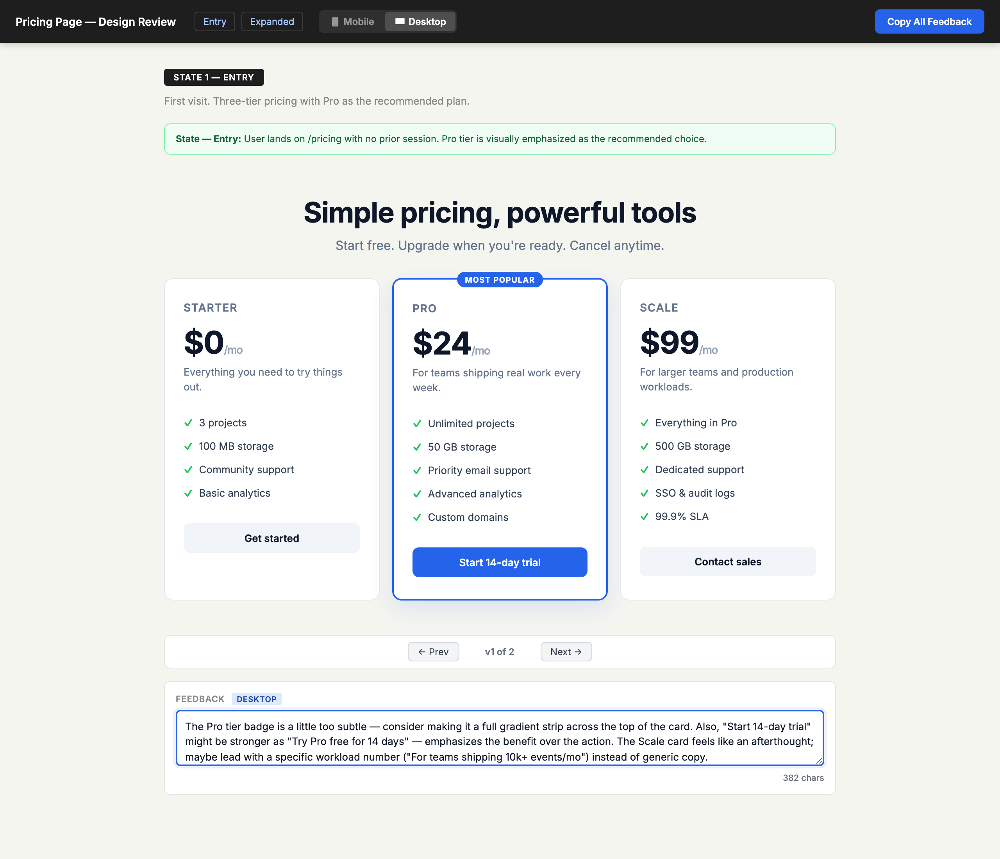

# ux-mockup

> Generate self-contained HTML mockups with built-in feedback collection, version history, and mobile/desktop toggle — for designers iterating with stakeholders.



## Use this when...

- You're redesigning a page and need non-technical stakeholders to leave feedback **without Figma accounts, logins, or setup**
- You want feedback **anchored to specific sections** — not vague "I don't like the header" messages in Slack
- You want to iterate on an existing live page **without touching the real codebase**
- You need a single HTML file you can **email or drop in a shared folder**, not a hosted prototype with auth
- You need to compare **multiple versions side-by-side** while collecting feedback on each one

## What you say to Claude

```
Mock up the new pricing page with three tiers (free, pro, scale).
I want to show it to two stakeholders and collect their feedback.
```

Claude generates a single HTML file at `docs/mockups/pricing.html`, opens it in your browser, and you send the link or the file itself to reviewers. They type feedback into each section's textarea and click **Copy All Feedback** to get a JSON blob they paste back into the chat.

For iterating on an existing live page:

```
Mock up changes to the /dashboard page — start by capturing
what's there now, then propose a denser layout as v2.
```

## Install

```bash
# From the claude-toolkit repo
./install.sh --skills ux-mockup             # into current project
./install.sh --global --skills ux-mockup    # into ~/.claude (all projects)
```

After install, Claude will invoke this skill automatically when you mention "mockup", "design review", or "mock up the flow". You can also trigger it explicitly with phrases like _"use the ux-mockup skill to..."_.

New to skills? See the [main README](../../README.md#what-is-a-skill) for a one-minute primer.

## What you'll see

The generated HTML file is fully self-contained (no CDN, no build step, works offline) and includes:

- **Per-section feedback textareas** — every design section gets its own comment box
- **Version history nav** — prev/next buttons flip between v1, v2, v3... of the same section
- **Mobile/desktop toggle** — swap the whole page between 375px and full-width
- **Copy All Feedback button** — exports every textarea as timestamped JSON to the clipboard
- **Design-note callouts** — yellow "Change:", blue "Future:", green "Info:" boxes for reviewer context

Reviewers don't install anything. They open the file, read, type, click Copy All Feedback, and paste the JSON back to you.

## The two modes

**From-scratch mode** — for new pages or components with no existing reference. Claude designs the layout, applies project CSS if available, and generates v1. You iterate by telling Claude what to change, and v2 is added to the same file with the nav auto-showing.

**Live-capture mode** — for reviewing and iterating on a page that already exists. Claude embeds the actual live page in an iframe (if publicly accessible), or extracts the real HTML and styles from your project source (for auth-protected or dynamic pages). The key rule: **never approximate what you can embed or extract.** A hand-drawn reconstruction that looks "close enough" defeats the purpose — reviewers need to see exactly what users see.

## See also

- [`qa-checklist`](../qa-checklist/README.md) — same feedback-collection pattern, but for manual QA testing after a PR
- [`frontend-design`](../frontend-design/README.md) — for implementing the approved design once feedback converges
