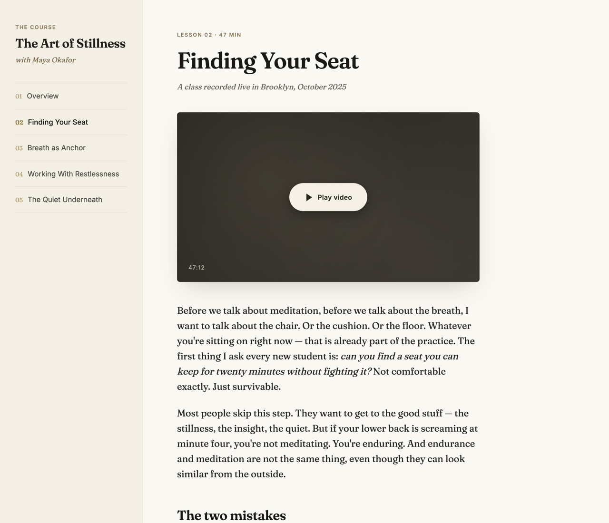

# video-course-site

> Turn a folder of video lectures into a readable, tabbed static site where each video becomes a blog post in the teacher's own voice.



## Use this when...

- You're sitting on **hours of recorded course videos** and want something readable people can skim, not just play
- You're a teacher or student who wants each lesson as a **blog post in the teacher's first-person voice**, not a cold summary
- You need **Q&A and guided meditations pulled out as their own sections**, with timestamps back to the video
- You want a **single-file static site** you can drop in Dropbox, email, or host anywhere — no build step, no CMS
- You want a pipeline that **skips work it's already done** so you can rerun it on new videos without starting over

## What you say to Claude

```
I have a folder of course videos at ~/Dropbox/courses/stillness-oct-2025.
Transcribe them, turn each one into a blog post in the teacher's voice,
and assemble a tabbed site I can share.
```

Claude runs the three-step pipeline — transcribe with whisper.cpp, dispatch one agent per transcript to write a blog post, assemble into `<folder>/site/index.html` with sidebar tab nav and Medium-style typography. Open the file and share it.

## Install

```bash
# From the claude-toolkit repo
./install.sh --skills video-course-site             # into current project
./install.sh --global --skills video-course-site    # into ~/.claude (all projects)
```

After install, Claude will invoke this skill automatically when you mention "course site", "transcribe videos", "video to blog", or "turn these lectures into posts". New to skills? See the [main README](../../README.md#what-is-a-skill) for a one-minute primer.

**Requires:** `ffmpeg` (`brew install ffmpeg`), `whisper.cpp` (`brew install whisper-cpp`), and the large-v3-turbo model downloaded to `~/whisper-models/ggml-large-v3-turbo.bin`. Transcription runs locally — no API keys.

## What you'll see

- **Sidebar lesson nav** — numbered tabs (01, 02, 03...) switch between lessons in-place
- **Per-lesson blog post** — written in the teacher's first-person voice, not a summary
- **Pulled-out Q&A blockquotes** — student questions in bold, teacher answers inline
- **Meditation markers** — guided meditations transcribed with timestamps back to the source video
- **Idempotent reruns** — skip already-transcribed videos and already-written posts; add a new video and rerun

## The three-step pipeline

**Step 1 — Transcribe.** `scripts/transcribe_videos.py` extracts audio via ffmpeg, runs whisper.cpp, and writes `.json`/`.srt`/`.txt` into `<folder>/transcripts/`. Long jobs can run backgrounded with `nohup caffeinate`.

**Step 2 — Generate posts in parallel.** Claude dispatches one agent per transcript. Each agent reads the `.txt`, writes an HTML fragment (`<h2>` title, `<h3>` sections, `<blockquote>` for Q&A, `meditation-marker` divs) to a local staging dir. If your source is in Dropbox, posts stage locally first so smart-sync can't dehydrate them to 0 bytes.

**Step 3 — Assemble.** `scripts/assemble_site.py` reads every `.html` fragment, builds the tab nav, and writes the final single-file `site/index.html`.

## See also

- [`ux-mockup`](../ux-mockup/README.md) — same self-contained HTML pattern, but for iterating on designs with stakeholder feedback
- [`insight-harness`](../insight-harness/README.md) — another "one HTML file is the deliverable" skill, pointed at your own Claude Code usage data
